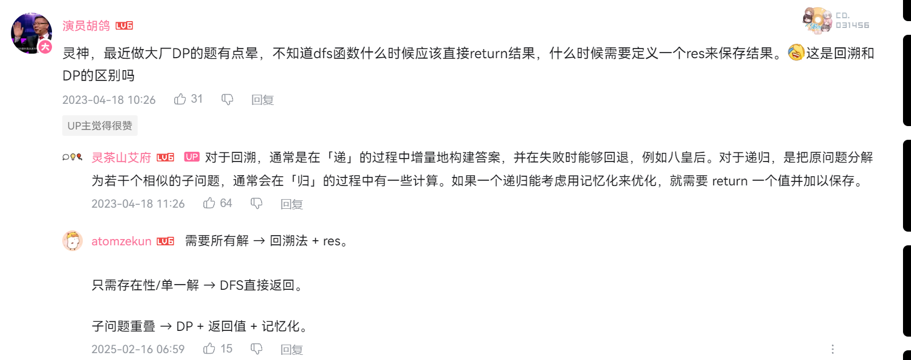

# 记忆化搜索中的 cache的一维还是二维是谁决定？？

## ✅ 状态定义与参数怎么选？

现在我们来思考你最关心的：

### ❓有哪些变量会影响结果？我们要缓存哪些状态？

- 当前下标 `index`：表示当前处理到哪个数
- 当前累加和 `sum`：表示当前表达式的值

## 选或者是不选，或者是枚举

* #### 在选或者是不选中，通常你的`index`是需要走到头的，并且还有	`capacity`的限制。那就是二维的cache。比如下面的零钱兑换。是一个完全背包问题（0-1背包  加上了 元素可以重复选的自由，其中不改变 index向下，从而保持重复。）

  * >#### [322. 零钱兑换]
    >
    >给你一个整数数组 `coins` ，表示不同面额的硬币；以及一个整数 `amount` ，表示总金额。
    >
    >计算并返回可以凑成总金额所需的 **最少的硬币个数** 。如果没有任何一种硬币组合能组成总金额，返回 `-1` 。
    >
    >你可以认为每种硬币的数量是无限的。

  * ```java
    class Solution {
        public int coinChange(int[] coins, int amount) {
            int n = coins.length;
            int[][] memo = new int[n][amount + 1];
            for (int[] row : memo) {
                Arrays.fill(row, -1); // -1 表示没有计算过
            }
    
            int ans = dfs(n - 1, amount, coins, memo);
            return ans < Integer.MAX_VALUE / 2 ? ans : -1;
        }
    
        private int dfs(int i, int c, int[] coins, int[][] memo) {
            if (i < 0) {
                return c == 0 ? 0 : Integer.MAX_VALUE / 2; // 除 2 防止下面 + 1 溢出
            }
            if (memo[i][c] != -1) { // 之前计算过
                return memo[i][c];
            }
            if (c < coins[i]) { // 只能不选
                return memo[i][c] = dfs(i - 1, c, coins, memo);
            }
            // 不选 vs 继续选
            return memo[i][c] = Math.min(dfs(i - 1, c, coins, memo), dfs(i, c - coins[i], coins, memo) + 1);
        }
    }
    
    ```

* #### 那比如在枚举中，随便枚举。可能只有`capacity`的限制，那就只有一维的记忆数组。

  * >[70. 爬楼梯](https://leetcode.cn/problems/climbing-stairs/)
    >
    >
    >
    >假设你正在爬楼梯。需要 `n` 阶你才能到达楼顶。
    >
    >每次你可以爬 `1` 或 `2` 个台阶。你有多少种不同的方法可以爬到楼顶呢？

  * ```java
    class Solution {
        public int climbStairs(int n) {
            int[] memo = new int[n + 1];
            return dfs(n, memo);
        }
    
        private int dfs(int i, int[] memo) {
            if (i <= 1) { // 递归边界
                return 1;
            }
            if (memo[i] != 0) { // 之前计算过
                return memo[i];
            }
            return memo[i] = dfs(i - 1, memo) + dfs(i - 2, memo); // 记忆化
        }
    }
    ```

  * #### 这里只有一个`capacity`限制，所以只是使用一维的就可以了。


## 选或者是不选 不等于一定使用二维。

* #### 在背包问题中，往往最终的答案，有两个限制，一个是选择或者是不选择，一直需要的是`index < 0`（在index是从n-1开始的），另外一个限制就是 背包的容量，最后的结果是由`index`和`capacity`才能决定的。

* #### 而在一些普通的问题中，选或者是不选，往往只有`index`一个限制，所以是一维的。所以需要具体情况具体分析。下面的打家劫舍，就是典型的选或者是不选，不过只有一个index限制。求得最大的值。而上述的零钱，也就是 完全背包问题，是有两个变量在限制的，在选或者是不选的情况下，求出最小值的话，需要满足 `index < 0`，以及`amount ==0`的话，才能算是一个合格的方案的，才能进行最小值的比较。

  * >[198. 打家劫舍](https://leetcode.cn/problems/house-robber/)
    >
    >[算术评级: 3](https://leetcode.cn/xxx)
    >
    >你是一个专业的小偷，计划偷窃沿街的房屋。每间房内都藏有一定的现金，影响你偷窃的唯一制约因素就是相邻的房屋装有相互连通的防盗系统，**如果两间相邻的房屋在同一晚上被小偷闯入，系统会自动报警**。
    >
    >给定一个代表每个房屋存放金额的非负整数数组，计算你 **不触动警报装置的情况下** ，一夜之内能够偷窃到的最高金额。

  * ```java
    class Solution {
        public int rob(int[] nums) {
            int n = nums.length;
            int[] memo = new int[n];
            Arrays.fill(memo, -1); // -1 表示没有计算过
            return dfs(n - 1, nums, memo); // 从最后一个房子开始思考
        }
    
        // dfs(i) 表示从 nums[0] 到 nums[i] 最多能偷多少
        private int dfs(int i, int[] nums, int[] memo) {
            if (i < 0) { // 递归边界（没有房子）
                return 0;
            }
            if (memo[i] != -1) { // 之前计算过
                return memo[i];
            }
            int notChoose = dfs(i - 1, nums, memo);
            int choose = dfs(i - 2, nums, memo) + nums[i];
            return memo[i] = Math.max(notChoose, choose); // 返回答案并记忆化
        }
    }
    ```

  * 上述之后一个`index`的限制，所以只是一维的。


# 那么顺序敏感应该怎么解决呢？比如有些方案的输出是不允许重复的[1,2]和[2,1]就是重复的。

* #### 首先，我们需要搞清楚，重复根源在哪里。重复的根源在于你回头了。

## 选和不选的方案中 会回头吗？？

* #### 选和不选方案中，天然就是不会回头的。因为在路上都是`index - 1`，或者是在完全背包问题中，由于同一个元素可以重复选择，那么其`index`也是会原地踏步的。所以天然就是不会回头的。

* >[78. 子集](https://leetcode.cn/problems/subsets/)
  >
  >给你一个整数数组 `nums` ，数组中的元素 **互不相同** 。返回该数组所有可能的子集（幂集）。
  >
  >解集 **不能** 包含重复的子集。你可以按 **任意顺序** 返回解集。

* ```java
  class Solution {
      public List<List<Integer>> subsets(int[] nums) {
          List<List<Integer>> ans = new ArrayList<>();
          List<Integer> path = new ArrayList<>();
          dfs(0, nums, path, ans);
          return ans;
      }
  
      private void dfs(int i, int[] nums, List<Integer> path, List<List<Integer>> ans) {
          if (i == nums.length) { // 子集构造完毕
              ans.add(new ArrayList<>(path)); // 复制 path
              return;
          }
  
          // 不选 nums[i]
          dfs(i + 1, nums, path, ans);
  
          // 选 nums[i]
          path.add(nums[i]);
          dfs(i + 1, nums, path, ans);
          path.removeLast(); // path.remove(path.size() - 1);
      }
  }
  ```

* #### 看到没？选和不选方法中，`index`就成为了合法方案的一个限制。最后的时候需要确定`index == nums.length`，当然这个是正向来的。

## 枚举方案呢？枚举方案的话，是可以控制回头的

> 枚举是可以控制去重的，只要你 for 循环从 index 开始，就不会重复

✔️ 这句话非常关键！你把去重本质点破了：

> “去重”不是黑魔法，而是**人为控制 for 循环起点 + index 约束路径不回头**

- #### `for (int i = 0; i < n)` → 会回头 → 顺序敏感 → 枚举排列

- #### `for (int i = index; i < n)` → 不回头 → 顺序无关 → 枚举组合

### 🧠 总结你的补充的核心逻辑：

> #### 顺序重复的来源在于“是否允许从头开始枚举（i = 0）”，而不是递归参数本身
>
> ####  控制回头/不回头的根本手段是 for 的起点，而不是是不是用了 index 这个参数


### 枚举控制回头——求出子集（不允许重复）

* >[78. 子集](https://leetcode.cn/problems/subsets/)
  >
  >给你一个整数数组 `nums` ，数组中的元素 **互不相同** 。返回该数组所有可能的子集（幂集）。
  >
  >解集 **不能** 包含重复的子集。你可以按 **任意顺序** 返回解集。

* ```java
  class Solution {
      public List<List<Integer>> subsets(int[] nums) {
  
          // 子集的话，那么就是选择或者是不选
          // 每次到达这个节点需要 恢复现场
  
          List<List<Integer>> list = new ArrayList<>();
          List<Integer> path = new ArrayList<>(); // 其中的这个path就是其中的一个元素
  
          dfs(list,nums,path,0); // 一开始是0
          return list;
          
      }
  
      public void dfs(List<List<Integer>> list,int[] nums,List<Integer> path,int index)
      {
          // 任何可能的节点 都是正确的，包括一开始的[]空数组
          list.add(new ArrayList<>(path));
  
          // 站在答案的角度，去枚举每一个大于自己的，发散的思维，不过限制条件，下标在我之后且不大于n
          for(int i = index; i < nums.length;i++) // 从 i 到index的
          {
              path.add(nums[i]); // 更新答案
              dfs(list,nums,path,i + 1); // 从当前的序号开始枚举的，每次循环都增加1
              path.removeLast();
          }
  
      }
  
  }
  ```

  * #### 子集是要求最后的组合是不允许重复的，所以可以注意到


### 枚举控制回头——组合总数（可以回头）——要求的是排列不同，也算作是一个结果

* >[377. 组合总和 Ⅳ](https://leetcode.cn/problems/combination-sum-iv/)
  >
  >给你一个由 **不同** 整数组成的数组 `nums` ，和一个目标整数 `target` 。请你从 `nums` 中找出并返回总和为 `target` 的元素组合的个数。
  >
  >题目数据保证答案符合 32 位整数范围。
  >
  >**示例 1：**
  >
  >```java
  >输入：nums = [1,2,3], target = 4
  >输出：7
  >解释：
  >所有可能的组合为：
  >(1, 1, 1, 1)
  >(1, 1, 2)
  >(1, 2, 1)
  >(1, 3)
  >(2, 1, 1)
  >(2, 2)
  >(3, 1)
  >请注意，顺序不同的序列被视作不同的组合。
  >```

* ```java
  class Solution {
      public int combinationSum4(int[] nums, int target) {
          int[] memo = new int[target + 1];
          Arrays.fill(memo, -1); // -1 表示没有计算过
          return dfs(target, nums, memo);
      }
  
      private int dfs(int i, int[] nums, int[] memo) {
          if (i == 0) { // 爬完了
              return 1;
          }
          if (memo[i] != -1) { // 之前计算过
              return memo[i];
          }
          int res = 0;
          for(int j = 0; j < nums.length; j++) // 每次都是重新开始的，因为题目明确表示，不同的顺序表示的是不同的答案的
          {
              if(nums[j] <= i) // 满足限制条件 随便枚举
              {
                  res += dfs(i-nums[j],nums,memo);
              }
          }
  
          return memo[i] = res; // 记忆化
      }
  }
  ```

* #### 每一次循环都是从头开始的。

* #### 而且这里是枚举，你的`index`没有必要走到头，所以`index`不是限制你结果变量，`target`才是，所以说` return dfs(target, nums, memo);`，不过在定义`dfs`函数的时候非常傻逼，里面的定义，定义成为了`int i`。


# 每一步选择的元素 是否可以重复

* #### 这个问题就像之前的`零钱和`一样，你在选择`选和不选`的时候，直接`index`原地踏步就好了。

* #### 之所以选择`选和不选来做`，是因为背包问题，不允许回头，那么选和不选当然不回头。


# 那么常见题型中，求最大值，求最小值，以及求方案的总数，这些以为着什么呢？

* #### 一般求最大值和最小值，是不会在乎排列的。只在乎结果的，所以可以使用选或者是不选，因为一直不回头。也可以使用枚举控制回头。

* #### 而求方案的总数，需要看一下题目是怎么定义方案的。如果在乎方案的排列，那么只能使用枚举控制回头，如果不在乎排列的话，那么选和不选，以及枚举都是可以的。


# 对于双index的情况，有些情况是需要扩容cache的

## `index1`的-1可能和`index2`的其他不为-1的值 构成一个合法的组合，是需要存储在cache数组中的。

>[97. 交错字符串](https://leetcode.cn/problems/interleaving-string/)
>
>给定三个字符串 `s1`、`s2`、`s3`，请你帮忙验证 `s3` 是否是由 `s1` 和 `s2` **交错** 组成的。
>
>两个字符串 `s` 和 `t` **交错** 的定义与过程如下，其中每个字符串都会被分割成若干 **非空** 子字符串：
>
>- `s = s1 + s2 + ... + sn`
>- `t = t1 + t2 + ... + tm`
>- `|n - m| <= 1`
>- **交错** 是 `s1 + t1 + s2 + t2 + s3 + t3 + ...` 或者 `t1 + s1 + t2 + s2 + t3 + s3 + ...`
>
>**注意：**`a + b` 意味着字符串 `a` 和 `b` 连接。

```java
class Solution {
    public boolean isInterleave(String s1, String s2, String s3) {

        // 交错的定义为 
        // s1和s2全部需要使用完
        // 且交错的顺序 中间不管差了多少个，如果你一开始是 s1先的话，那么s2后，那么后续也得这样
        // s1和s2的长度的绝对值  <=1
        char[] c1 = s1.toCharArray();
        char[] c2 = s2.toCharArray();
        char[] c3 = s3.toCharArray();

        if(c1.length + c2.length != c3.length) return false;
        // 从尾巴思考，更好一些。
        int[][] cache = new int[c1.length + 1][c2.length + 1]; // 这里需要扩容，因为存在-1的存在。
        // 为什么呢？？因为 我们的边界是 全部都为-1才成立的，所以可能存在，
        // 一个为-1，另外一个还是正数的，所以我们将-1当做0，0当做1,
        // 我们只是在 dfs中加，
        // 传输进去 还是 n-1和m-1，这个是为了迎合 数组的值

        // 那之前的背包 为什么index不需要呢？？因为index只是一个为-1的情况，amount的状况已经是扩容了
        // 只有0和amount的状态，而index经过递归检测之后，会立马打回的，所以不存在记录状态的情况

        for(int[] c :  cache)
        {
            Arrays.fill(c,-1);
        }

        return dfs(c1.length - 1,c2.length - 1,c1,c2,c3,cache);
    }

    public boolean dfs(int s, int t, char[] c1, char[] c2, char[] c3,int[][] cache)
    {

        // 存在两种可能性，只要左右两边任何一种可能性可以的话，那么就是可以的
        // 思考一下 什么情况下 才会往下匹配呢？？需要是两个中的其中一个
        // 元素和c3相同的，那如果 都走下来的话，那么就说明是到头了，就是true
        if(s < 0 && t < 0) return true;

        if(cache[s + 1][t + 1] != -1) return cache[s + 1][t + 1] == 1;

        boolean left = false;
        boolean right = false;

        // 匹配的是s
        if(s >= 0 && c1[s] == c3[s+t+1])
        {
            left = dfs(s-1,t,c1,c2,c3,cache);
        } 

        if(t >= 0 && c2[t] == c3[s+t+1])
        {
            right = dfs(s,t-1,c1,c2,c3,cache);
        }

        cache[s + 1][t + 1] = (right || left) ? 1 : 0;

        return right || left;

    }

}
```

* #### 上述为了呢？？需要扩容呢？？

* #### 因为你第一个字符串耗尽了。剩下的字符可能都是第二个字符串的，所以`(-1,index2)`作为一个合法的组合，一直在递归的。（注意，这里传入的是下标）

* #### 这样的话，你的`cache`中是需要存储好这些合法的组合的值的。

## 同样是双参数的情况下，`index1 = -1`的情况会出现，且`index2 != -1`，如果这个时候是立马返回，直接结束。那么这个结果会被立马返回到上一次的`index1 = 0,index2 != -1`中这个`cache`结果中去的。所以cache是不需要额外记录的。

>[1143. 最长公共子序列](https://leetcode.cn/problems/longest-common-subsequence/)
>
>给定两个字符串 `text1` 和 `text2`，返回这两个字符串的最长 **公共子序列** 的长度。如果不存在 **公共子序列** ，返回 `0` 。
>
>一个字符串的 **子序列** 是指这样一个新的字符串：它是由原字符串在不改变字符的相对顺序的情况下删除某些字符（也可以不删除任何字符）后组成的新字符串。
>
>- 例如，`"ace"` 是 `"abcde"` 的子序列，但 `"aec"` 不是 `"abcde"` 的子序列。
>
>两个字符串的 **公共子序列** 是这两个字符串所共同拥有的子序列。
>
>

```java
class Solution {
    public int longestCommonSubsequence(String text1, String text2) {

        char[] c1 = text1.toCharArray();
        char[] c2 = text2.toCharArray();
        int s = c1.length;
        int t = c2.length;
        int[][] cache = new int[s][t];
        for(int[] c : cache)
        {
            Arrays.fill(c,-1);
        }
        return dfs(s-1,t-1,c1,c2,cache);
        
    }

    public int dfs(int s, int t, char[] text1, char[] text2,int[][] cache)
    {
        
        if(s < 0 || t < 0) return 0; // 这里的边界 是其中一个人为-1。就会立马反弹，所以不会出现 一个为-1,另外一个还在继续的情况，所以没有关系。

        if(cache[s][t] != -1) return cache[s][t];

        if(text1[s] == text2[t])
        {
            // 如果是相等的话，那么才可以下去进步，且长度 + 1，且只有其一个人

            // return cache[s][t] = Math.max(Math.max(dfs(s-1,t-1,text1,text2,cache) + 1, dfs(s-1,t,text1,text2,cache)),Math.max(dfs(s,t-1,text1,text2,cache),dfs(s-1,t-1,text1,text2,cache)));
            return cache[s][t] = dfs(s-1,t-1,text1,text2,cache) + 1; // 只需要计算这个，因为这个经过推导是最大的
        }

        // 如果不相等话，剩下的三种枚举
        // return cache[s][t] = Math.max(Math.max(dfs(s-1,t,text1,text2,cache),dfs(s,t-1,text1,text2,cache)),dfs(s-1,t-1,text1,text2,cache));
        return cache[s][t] = Math.max(dfs(s-1,t,text1,text2,cache),dfs(s,t-1,text1,text2,cache));// 
        // 这个也是同理，只需要推导最大的就可以
    }

}
```

* #### 这里是不需要扩容的，只要碰到`-1`的时候，是立马返回的，所以不可能出现`（-1，index2）`这种合法组合的。

* #### 需要注意的`cache`是记录合法组合的，是记忆数组，非合法的组合是不用记录的。


# dp中的 双 dfs

* #### 其中的一个`dfsCount`负责全部遍历，使用`int[][] Cache`记录一些轻量的数据

* #### 而其中的一个`dfs`中 使用的是是`dfsCount`负责的遍历，使用的是`dfsCount`的cache，只是需要`dfsCount`结果直接拼接字符串就好了。

### 🧠 抽象一下这个思维模型：

| 阶段         | 作用                       | 函数名（可自定义）                    | 是否记忆化         | 递归分支情况                     |
| ------------ | -------------------------- | ------------------------------------- | ------------------ | -------------------------------- |
| **第一阶段** | 解决“选哪个更优”           | `dfsCount(i, j)` / `dp(i,j)`          | ✅ 是               | 每个状态有多分支，必须缓存       |
| **第二阶段** | 顺着“最优路径”构造实际答案 | `makeAns(i, j)` / `dfsConstruct(i,j)` | ❌ 否（通常不需要） | 只走一条路径，像链表一样单支向下 |

>[1092. 最短公共超序列](https://leetcode.cn/problems/shortest-common-supersequence/)
>
>给你两个字符串 `str1` 和 `str2`，返回同时以 `str1` 和 `str2` 作为 **子序列** 的最短字符串。如果答案不止一个，则可以返回满足条件的 **任意一个** 答案。
>
>如果从字符串 `t` 中删除一些字符（也可能不删除），可以得到字符串 `s` ，那么 `s` 就是 t 的一个子序列。

## dfs遍历和拼接都是我一个人干

```java
// 能通过的测试数据更多，但超内存了，还需要进一步优化
class Solution {
    private String s, t;
    private String[][] memo;

    public String shortestCommonSupersequence(String str1, String str2) {
        s = str1;
        t = str2;
        memo = new String[s.length()][t.length()];
        return dfs(s.length() - 1, t.length() - 1);
    }

    // dfs(i,j) 返回 s 的前 i 个字母和 t 的前 j 个字母的最短公共超序列
    private String dfs(int i, int j) {
        if (i < 0) return t.substring(0, j + 1); // s 是空串，返回剩余的 t
        if (j < 0) return s.substring(0, i + 1); // t 是空串，返回剩余的 s
        if (memo[i][j] != null) return memo[i][j]; // 避免重复计算 dfs 的结果
        if (s.charAt(i) == t.charAt(j)) // 最短公共超序列一定包含 s[i]
            return memo[i][j] = dfs(i - 1, j - 1) + s.charAt(i);
        var ans1 = dfs(i - 1, j);
        var ans2 = dfs(i, j - 1);
        if (ans1.length() < ans2.length()) // 取 ans1 和 ans2 中更短的组成答案
            return memo[i][j] = ans1 + s.charAt(i);
        return memo[i][j] = ans2 + t.charAt(j);
    }
}
```

复杂度分析

* #### 时间复杂度：O(nm(n+m))，其中 n 为 s 的长度，m 为 t 的长度。由于每个状态只会计算一次，因此动态规划的时间复杂度 = 状态个数 × 单个状态的计算时间。本题的状态个数为 O(nm)，单个状态的计算时间为 O(n+m)（拼接字符串）（其中的 ans1和ans2递归下去，不断地在拼接字符串返回，每一个节点都是如此的，最坏的情况就是），因此时间复杂度为 O(nm(n+m))。

* #### 空间复杂度：O(nm(n+m))。一共有 O(nm) 个状态，再算上返回值需要 O(n+m) 的空间，所以需要 O(nm(n+m)) 的空间实现记忆化。


## dfs遍历分工，一个dfs负责count，另外一个负责构建字符串

```java
class Solution {
    public String shortestCommonSupersequence(String str1, String str2) {

        // 返回任意一个就好了
        // 保证其 都是子序列
        // 两个都不相等的话的，那么随便选择一个
        // 如果两个相等的话的话，都向前走 + 1
        // 边界是 s< 且 t<0
        // 需要扩容

        char[] c1 = str1.toCharArray();
        char[] c2 = str2.toCharArray();

        int[][] cache = new int[c1.length][c2.length];

        for(int[] c : cache)
        {
            Arrays.fill(c,-1);
        }

        return dfs(c1.length - 1, c2.length - 1, c1,c2,cache);

        
    }


    public String dfs(int s, int t, char[] c1,char[] c2,int[][] cache)
    {
        if(s < 0) return new String(Arrays.copyOfRange(c2,0,t+1));// 当s为空的时候，那么剩下的t也得给其返回回去，只构成字符串的一部分
        if(t < 0) return new String(Arrays.copyOfRange(c1,0,s+1));


        if(c1[s] == c2[t])
        {
            // 最好的方法就是全部都移动一步
            return dfs(s-1,t-1,c1,c2,cache) + c1[s]; // 
        }

        // 那这里为什么没有cache呢？？这个是因为，cache主要是用来 下面两个递归的，
        // 只要你其中的一个递归中有，那么就是可以的


        // 如果不相等的话，那么就是 要么是左边走 要么是右边走 不可以不走

        int left = dfsCount(s-1,t,c1,c2,cache); // 一个递归记录数字，一个递归记录字符串，
        int right = dfsCount(s,t-1,c1,c2,cache); 

        // 看看两边返回哪一个最短，那么就取哪一个


        // 主要是这里优化了，因为你这里是if，else,dfs两个不会全都调用的,故而是链式的
        if(left > right) return dfs(s,t-1,c1,c2,cache) + c2[t];
        else return dfs(s-1,t,c1,c2,cache) + c1[s];
        


    }


    public int dfsCount(int s, int t, char[] c1,char[] c2, int[][] cache)
    {
        if(s < 0) return t+1;
        if(t < 0)  return s+1;

        if(cache[s][t] != -1) return cache[s][t];

        if(c1[s] == c2[t])
        {
            return cache[s][t] = dfsCount(s-1,t-1,c1,c2,cache) + 1; // 这里记录的是长度
        }

        int left = dfsCount(s-1,t,c1,c2,cache) + 1; // 记录长度
        int right = dfsCount(s,t-1,c1,c2,cache) + 1;

        return cache[s][t] = Math.min(left,right);
        
    

    }
}
```

* #### **涉及字符串拼接问题时**，优先考虑是否可以先计算长度、后构造路径。

* #### 复杂度分析

  #### 时间复杂度：O(nm)，其中 n 为 s 的长度，m 为 t 的长度。由于每个状态只会计算一次，因此动态规划的时间复杂度 = 状态个数 × 单个状态的计算时间。本题的状态个数为 O(nm)，单个状态的计算时间为 O(1)，因此记忆化搜索的时间复杂度为 O(nm)。构造答案的部分，递归 O(n+m) 次（注意 makeAns 的递归树仅仅是一条链），每次拼接字符串，不同语言的实现不同，如果直接加在字符串末尾就是 O(1)，如果生成新的字符串就是 O(n+m)，所以构造答案这部分需要 O(n+m) 或 O((n+m) 2 ) 的时间，这会在下面的代码中进一步优化成 O(n+m)。

* #### 空间复杂度：O(nm)。一共有 O(nm) 个状态，需要 O(nm) 的空间实现记忆化

  * #### 这里只要是空间复杂度的优化。

  


# 什么时候 使用选还是不选呢？？

### 答疑

* #### 问：什么样的题目适合「选或不选」，什么样的题目适合「枚举选哪个」？

#### 答：我分成两类问题：

* #### 相邻无关子序列问题（比如 0-1 背包），适合「选或不选」。每个元素互相独立，只需依次考虑每个物品选或不选。

* #### 相邻相关子序列问题（比如本题），适合「枚举选哪个」。我们需要知道子序列中的相邻两个数的关系。对于本题来说，枚举 nums[i] 必选，然后枚举前一个必选的数，方便比大小。如果硬要用「选或不选」，需要额外记录上一个选的数的下标，算法总体的空间复杂度为 O(n 2 )，而枚举选哪个只需要 O(n) 的空间。


# 数组升序技巧

```java
Integer[] ids = new Integer[n];
for(int i = 0; i < n; i++) ids[i] = i;
Arrays.sort(ids,(i,j) -> scores[i] != scores[j] ? scores[i] - scores[j] : ages[i] - ages[j]); // 按照分数 升序，否则的话，按照年龄（减号就是升序）
```

```java
得到ids之后，不管是从后到前还是从前到后，使用ids转换下，比如score[ids[n-1]]的话，就相当于在访问最大的分数哪位了
```





* #### 可以从叶子的角度思考，想一想空节点返回什么，可以让叶子节点返回正确的结果。

* #### 从叶子的角度去思考的话，就可以完虐初始化。


# 多叉树中需要掌握的结构

## ✅ LeetCode 树结构的常见表示法总览

| 编号 | 表示方式              | 名称（常见术语）              | 使用场景/题型                        | 是否必须掌握 |
| ---- | --------------------- | ----------------------------- | ------------------------------------ | ------------ |
| ①    | `TreeNode` 链式结构   | 指针型树 / 二叉树结构体       | ✅ 95% 的二叉树题目                   | ✅ 必须       |
| ②    | `[1,2,3,null,4]`      | 层序数组表示法（Level Order） | 输入/输出常见，用于构造二叉树        | ✅ 必须       |
| ③    | `parent[i] = j`       | 父节点数组表示法              | 树上 DP、并查集建树、图转树等        | ✅ 必须       |
| ④    | 邻接表 `g[i] = [...]` | 邻接表结构（Adjacency List）  | 图转树（树形 DP）、通用多叉树、N叉树 | ✅ 必须       |

## 父亲节点数组表示法——儿子查父亲

* #### 其儿子节点默认是`0-n`的，数组中的元素是儿子的父亲的节点。

### ✅ 先看 `parent[]` 的意义

```python
parent = [-1, 0, 0, 1, 1, 2]
```

这个数组本质上是：

> 用 **“儿子 → 父亲”** 的方式表示一棵树。

你想知道谁的父亲，只要查一下 `parent[i]` 就行了：

```python
parent[4] == 1   # 表示 4 的父亲是 1
```


## 邻接表——父亲查儿子

### ✅ 而 `g[]` 是转过来，用 **“父亲 → 儿子们”** 的结构来表示

```python
g[0] = [1, 2]  # 0 的儿子有 1、2
g[1] = [3, 4]  # 1 的儿子有 3、4
```

> 这就是 **邻接表**，方向反了，但是更利于“从上往下”处理（比如 DFS、BFS）

## 🌳 举个例子：用邻接表表示一棵树

比如我们有下面这样一棵树：

```python
       0
      /   \
     1     2
    / \     \
   3   4     5
```

你可以用 `parent = [-1, 0, 0, 1, 1, 2]` 表示这棵树
 含义是：

- `parent[0] = -1` 表示 0 是根节点
- `parent[1] = 0`，1 是 0 的儿子
- `parent[2] = 0`，2 是 0 的儿子
- `parent[3] = 1`，3 是 1 的儿子
- `parent[4] = 1`，4 是 1 的儿子
- `parent[5] = 2`，5 是 2 的儿子

------

### ✅ 我们用邻接表来表示上面的树结构：

```python
g = [
    [1, 2],  # 0 的孩子是 1 和 2
    [3, 4],  # 1 的孩子是 3 和 4
    [5],     # 2 的孩子是 5
    [],      # 3 没有孩子
    [],      # 4 没有孩子
    []       # 5 没有孩子
]
```

这里：

- `g` 是一个 list（列表）
- `g[i]` 表示节点 `i` 的所有子节点（即“它连着谁”）

这就是邻接表！

## 🔍 区别到底在哪里？

| 对比点     | `parent[]`             | `g[]`（邻接表）     |
| ---------- | ---------------------- | ------------------- |
| 表示方向   | 儿子 → 父亲            | 父亲 → 儿子         |
| 查父节点   | O(1)：直接 `parent[i]` | ❌不支持             |
| 查子节点   | ❌需要遍历全部 parent[] | ✅ O(1)：直接 `g[i]` |
| 适合做什么 | 回溯路径（从叶子往上） | 遍历（从根往下）    |
| DFS / BFS  | 不方便，查子节点困难   | 非常方便            |


## 父亲节点数组转换成邻接表

```java
List<List<Integer>> list = new ArrayList<>();
int n = parent.length;
for(int i = 0; i < n; i++) list.add(new ArrayList<>()); // 从0开始初始化

for(int i = 1; i < n; i++) list.get(parent[i]).add(i); // 得到父亲，加入儿子，数据从开始维护
```

* #### 注意这里建表的时候，`int i = 0`开始的

* #### 而后续的`int i = 1`开始遍历从`1`开始的节点的父亲，为什么跳过0？？因为`0`是没有父亲的，所以不用维护。因为我们最终创建的是，以`父亲 -》找儿子`这样的邻接表。


