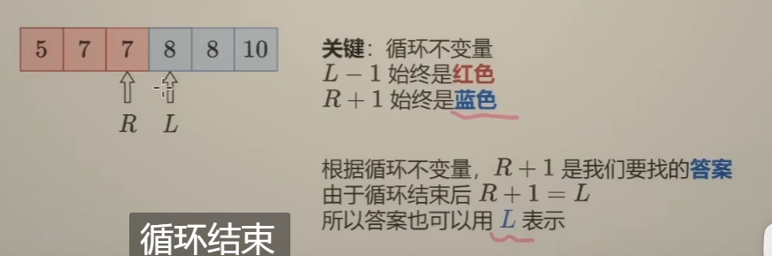
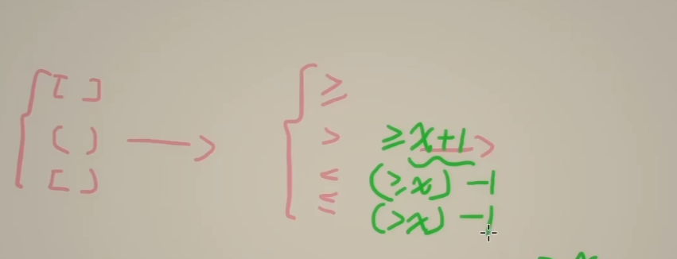

# low-bound的总结



* R + 1是答案
* L也是答案




# lower-bound和upper-bound的解释和公式

## 一、什么是 `lower_bound`

### ✅ 定义：

> 在一个有序数组中，**第一个满足 ≥ target 的位置**。

### 🔍 示例：

对于数组 `arr = [1, 3, 3, 5, 7]`，`target = 3`

- `lower_bound(3)` → 返回 index 1（`arr[1] = 3`）

### ✅ 本质含义：

> 找到第一个满足条件的值，所以这个是“最小满足条件”的定位方式。

### ✅ 使用逻辑：

```java
while (left <= right) {
    int mid = (left + right) / 2;
    if (arr[mid] >= target) {
        right = mid - 1; // 保留可能更小的
    } else {
        left = mid + 1;
    }
}
// left 是答案（第一个 ≥ target 的位置）
```


## 二、什么是 `upper_bound`

### ✅ 定义：

> 在一个有序数组中，**第一个满足 > target 的位置**。

### 🔍 示例：

数组 `arr = [1, 3, 3, 5, 7]`，`target = 3`

- `upper_bound(3)` → 返回 index 3（`arr[3] = 5`）

### ✅ 本质含义：

> 找到第一个不再等于 target 的更大值位置，通常用于“跳过所有 =target 的位置”

### ✅ 使用逻辑：

```java
while (left <= right) {
    int mid = (left + right) / 2;
    if (arr[mid] > target) {
        right = mid - 1; // 找更小的 >target
    } else {
        left = mid + 1; // 跳过 =target 的
    }
}
// left 是答案（第一个 > target 的位置）
```

## 三、注意！二者都在找“第一个满足某条件的下标”，区别在于：

| 项目       | lower_bound                 | upper_bound                 |
| ---------- | --------------------------- | --------------------------- |
| 条件       | `>= target`                 | `> target`                  |
| 返回的含义 | 第一个满足 `≥target` 的位置 | 第一个满足 `>target` 的位置 |
| 返回的值   | 第一个合法值                | 第一个非法值之后的位置      |


## 总结

* #### 本质都是在寻找第一个。

* #### 中间的判断条件 `check(mid) = arr[mid] > target`或者是`check(mid) = arr[mid] >= target`的本质在判断单调，mid之前的全是true，mid之后的全是false。

* #### 只有这样的话，才是在寻找第一个的。

* #### 为什么说是在寻找第一个呢？？是因为在保证前前面全是true，且后面全是false的情况下，我每次满足条件的，我的`right = mid - 1`，我都是左边移动的。所以致力于寻找第一个。


# 在确定target的情况下的转换。

### ✅ 对比转化表格

| 原始关系 | 等价形式          | 实现方式                       | 最终结果                      |
| -------- | ----------------- | ------------------------------ | ----------------------------- |
| `>= x`   | 原样使用          | check(mid) ≥ x                 | 返回第一个 ≥ x 的位置（left） |
| `> x`    | 转成 `>= x + 1`   | check(mid) ≥ x+1               | 返回第一个 > x 的位置（left） |
| `<= x`   | 转成 `> x` 再减 1 | `left = upper_bound(x)`，再 -1 | 返回最后一个 ≤ x 的位置       |
| `< x`    | 转成 `>= x` 再 -1 | `left = lower_bound(x)`，再 -1 | 返回最后一个 < x 的位置       |

* #### 在知道target的情况下，可以轻松这样转换的。不过下面还是拆解一下都是什么意思。

>#### 注意一下，
>
>#### 所谓的原始关系 和最终结果的意思。<= x就是表示 返回最一个 <= x的位置。
>
>#### 为什么会出现？？是因为我们实际的需要，有这种业务场景。我们只是使用 <= x这个符号来表达这个意思。
>
>


>#### 下面所说的 使用`arr[mid] >= target`的公式解决。是一定是在 arr[mid] >= target 实现 right = mid - 1 这个是写死的，不要随便更改。如果随便更改了，那么就失效了。
>
>

* #### 其中的`>= `表示的就是单调数组中`arr[mid] >= target`，满足这个条件下，我每次还都`right = mid - 1`那么就是寻找第一个。

* #### `>x`也是一样的道理，只需要更改一下条件就好了，变成`arr[mid] > target`就好了。不过如果想套用第一种情况的公式的话，什么叫做套用公式呢？？就是你表达的意思不变，你将你的`>x`转换成`>=x + 1`这两个结果是一样的。所以我直接套用`arr[mid] >= target`公式去解决就可以了。

* #### `<=x`话，变成`arr[mid] > target`，也是一样的的，你表达的意思不变。表达的就是返回最后一个 `<=x`的位置。也就是`(>x) - 1 `，即`(>=x + 1) - 1 `，还是套用`arr[mid] >= target`公式去解决就可以了。

* `<x`的话，也是一样的，就不赘述了。


# 如果没有target，不给你修改怎么办？？check(mid)的本质是什么？？

## ✅ 一、先明确问题：

你发现 check() 的形式不是 `nums[i] >= target` 或 `nums[i] > target` 时，就不知道该如何用 `lower_bound` 或 `upper_bound` 模板去写，**感觉“脱离了数组元素”就无法套公式**，对吧？

但真相是：

> #### ✅ 只要你能构造一个“单调性 check 函数”，无论里面是不是数组，都可以使用 lower_bound 或 upper_bound 的结构。

>#### 单调check函数是什么意思？比如mid这个点，前面都是false，后面都是true
>
>#### 是不是很熟悉，nums[i] >= target和 nums[i] > target不就是这样的吗？？你这个表达式 不就是相当于一个check吗？？？这个表达是 也是前面都是true，后面都是false，因为nums前提是单调的啊。
>
>##### 所以这个本质不就是寻找 第一个 让这个表达式为true的下标吗？？
>
>#### 那如果碰见那种 ，前面都是true，后面都是false，寻找最后一个true呢？？？
>
>#### 这个不就是nums[i] <= target吗？？可是啊，在这种check(mid)中，有一个很坑的点，你没有办法去修改这个target，无法全部转化成nums[i] >= target的公式去计算，那怎么办？？只能修改公式。怎么修改？
>
>#### 修改方法：也就是我们需要找到为true的最后一个，即我们满足的true的时候，就left = mid + 1，和上述的公式是相反的——可以参考一下下面的upper-bound的公式。最终的答案是right。和上述的公式也是相反的，上述nums[i] >= target的公式是left


下面我将分三段讲清楚：

## ✅ 二、Lower Bound / Upper Bound 的完整通用模板（重点是 check 单调性）

### 🎯 通用前提：

必须满足：

> `check(x)` 是一个**单调性函数**，且**形如**：前面全是 false，后面全是 true（或相反，根据目标取法）。

------

### 📌 lower_bound 的模板（找第一个满足 check() == true 的位置）：

```java
int left = 最小可能值;
int right = 最大可能值;
int ans = -1;

while (left <= right) {
    int mid = left + (right - left) / 2;

    if (check(mid)) {
        ans = mid;       // 记录解
        right = mid - 1; // 往左收缩：找第一个满足的
    } else {
        left = mid + 1;  // 不满足，往右收缩
    }
}
return ans;
```

* 也可以直接使用left，不使用ans。

* #### 总之看情况、

### 📌 upper_bound 的模板（找最后一个满足 check() == true 的位置）：

```java
int left = 最小可能值;
int right = 最大可能值;
int ans = -1;

while (left <= right) {
    int mid = left + (right - left) / 2;

    if (check(mid)) {
        ans = mid;       // 记录解
        left = mid + 1;  // 继续往右：找最后一个满足的
    } else {
        right = mid - 1; // 不满足，往左收缩
    }
}
return ans;
```

* #### 也可以直接返回right。可以不使用ans.


## ✅ 三、那什么是 check() 的本质要求？

> ❗️你无需关心 check(x) 的形式是否是 `nums[i] >= target`，你只需要保证 **它对 x 是单调的**！

### 🧠 抽象成一句话：

> ✅ 如果你的 check(x) 函数满足：
>
> - 当 x 变大（或变小）的时候，check(x) 的值单调变化；
> - 且你有一个 clear 的“分界点”——比如：从 false → true，或者 true → false；
>
> 那你就可以用 lower_bound 或 upper_bound。

------

### ✅ 举例：你的代码逻辑中的 check(x)

你这段 check(long coins) 是判断：

```java
是否存在一台机器 i，可以在预算 budget 内造出 coins 个合金。
```

它的变化趋势是：

- coins 越多 → 每种金属用得越多 → 花的钱也越多
- 花的钱越多 → 更可能超出预算 → check(coins) 越不成立

* #### **所以：`coins 越大，check(coins)` 越容易变成 false → 是前 true 后 false 的结构**

* 找的是最大值。

------

### 🚨但注意：这种是「反向单调」！

所以你要用 upper_bound（最后一个成立的）：


# 终极公式

## ✅ 一、你说的这三句结论，总结成判断表：

| 查找目标              | 用途类型 | 返回下标表达式              | 失败条件                                   |
| --------------------- | -------- | --------------------------- | ------------------------------------------ |
| `== target`（通过 ≥） | 精确查找 | `res = lowerBound(x)`       | `res == nums.size()||nums[res] != target ` |
| `== target`（通过 ≤） | 精确查找 | `res = lowerBound(x+1) - 1` | `res == -1 || nums[res] != target`         |
| `≥ target`            | 范围查找 | `res = lowerBound(x)`       | `res == size`                              |
| `> target`            | 范围查找 | `res = lowerBound(x+1)`     | `res == size`                              |
| `≤ target`            | 范围查找 | `res = lowerBound(x+1) - 1` | `res == -1`                                |
| `< target`            | 范围查找 | `res = lowerBound(x) - 1`   | `res == -1`                                |


## ✅ 二、补全“查找目标 vs 行为”图谱（最终统一图）

| 查找目标 | 使用方式              | 范围查找失败判断 | 精确查找需额外判断              |
| -------- | --------------------- | ---------------- | ------------------------------- |
| `≥ x`    | `lowerBound(x)`       | `res == size`    | `nums[res] == x` 才说明精确命中 |
| `> x`    | `lowerBound(x+1)`     | `res == size`    | 不能用于精确查找 x（跳过了）    |
| `≤ x`    | `lowerBound(x+1) - 1` | `res == -1`      | `nums[res] == x` 才说明精确命中 |
| `< x`    | `lowerBound(x) - 1`   | `res == -1`      | 不能用于精确查找 x（没到 x）    |


## ✅ 三、一句话总结让你完全稳住

> 🧠 **范围查找只判断是否“存在可用位置”**
>
> 🧠 **精确查找还必须判断该位置值是否等于 target**

------

## ✅ 四、建议你记住的终极两行公式（精确查找专用）

```java
// 精确查找 target（左闭右闭）
int res = lowerBound(nums, target);
if (res == nums.size() || nums[res] != target) {
    // 没有找到 target
}

// 精确查找 target（用 <= 模拟）
int res = lowerBound(nums, target + 1) - 1;
if (res == -1 || nums[res] != target) {
    // 没有找到 target
}
```


