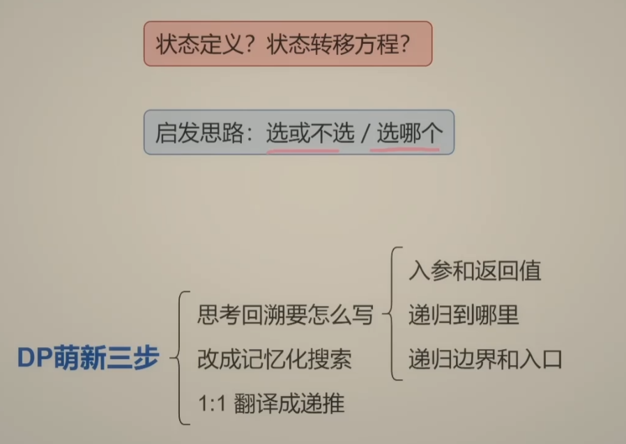
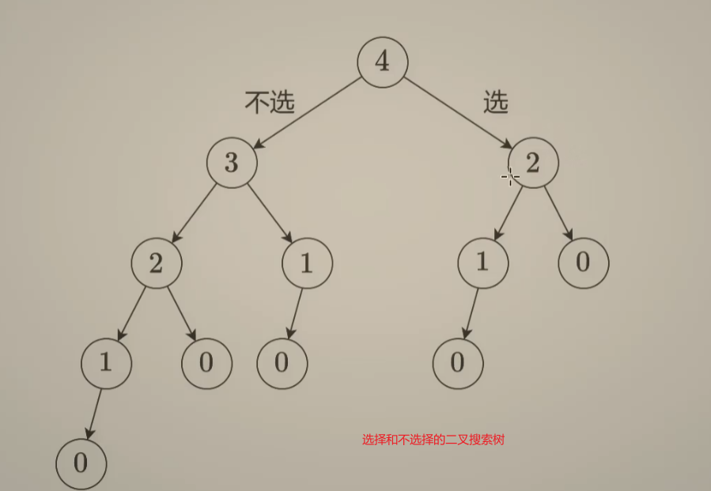
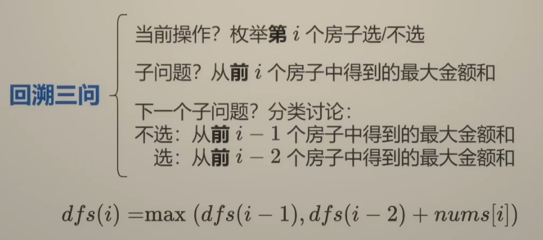
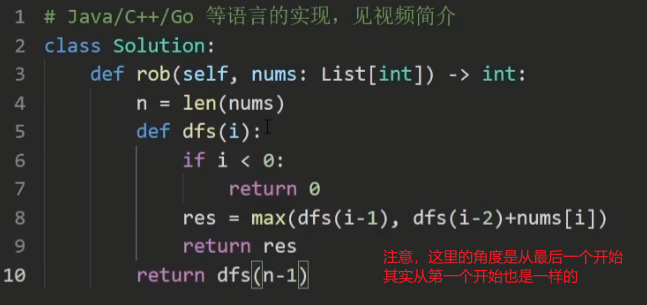
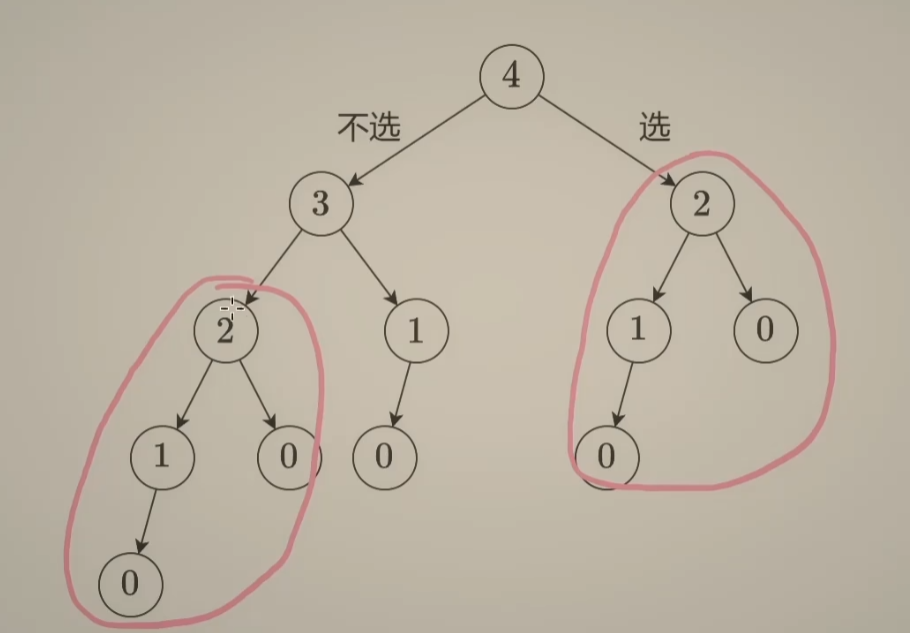
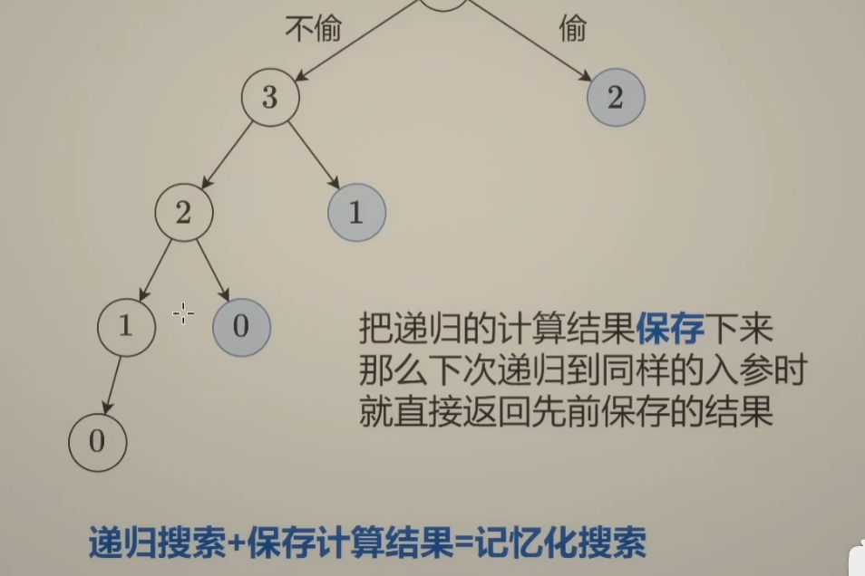
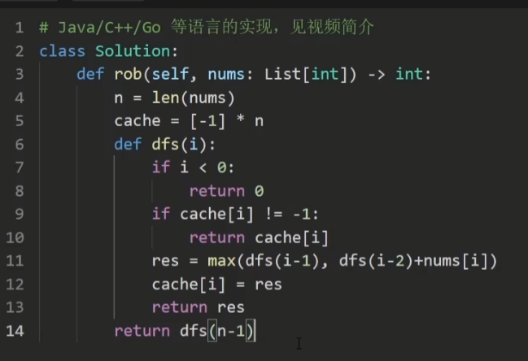
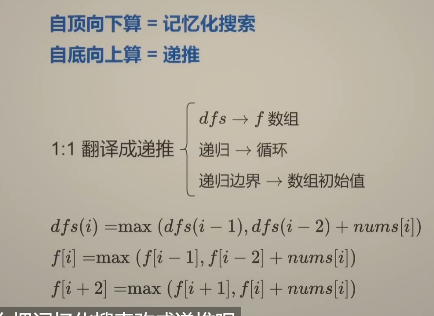

# dp的状态转移方程是有返回值的

* #### dp的状态转移方程，是可以依据回溯推出来的。

* #### 回溯---》剪枝----》回溯 + 记忆搜索---》递推（从底部到上方，状态转移方程是其中的一员）

# DP三问




# 初始方式——回溯（选和不选，全部枚举）

* #### 选和不选，或者是 枚举。

* #### 时间复杂度很高，二叉树或者是多叉树。——很原始的方法

* #### 回溯的时间复杂度是指数级别的。






* #### 注意，这里的dfs是有返回值的。

* #### 相当于后序递归上来的，每一次带上来的都是他这个分支的结果。那么上述的例题有左右两个分支所以返回上去的时候，需要加上本node的值。

* #### 那你可能有疑问：我们经常不是使用递这个动作吗？？将`path`和`resList`传入到每一个递归中去，让在最后在边界条件的时候反弹。

* #### 这里的返回是有妙用的，为后续的记忆化和剪枝以及最后推导出 递推服务的（所谓的递推，在递的过程没有任何的积累，在归bounce的过程，自底部向上，不断积累然后返回，便于后续的优化）——本质可以理解为后续遍历的归。





# 回溯 + 记忆数据结构 = 记忆搜索——自顶而下（递归，不断递进去，归回来）




* #### 上述圈起来的，就是`dfs(2)`，由于这里的`dfs(2)`都是返回值的函数，所以当你在回溯的时候，每次递归的时候，可以看看其是否已经算过了，是否存放在hash结构中，因为这样的话，每次查询是01，这样的话不用去递归返回结果了，相当于是剪枝。省去了时间复杂度。




* #### 记忆保存。

* #### 也可以使用一个数组来存储结果。

* 

* #### 在递归进来之后，在下一次递归之前，看看自己是否是保存了的，如果保存了，就直接返回保存的东西。


# 记忆搜索的记忆存储空间能不能优化掉？？？

* #### 这也能优化？？

* #### 记忆化搜索 有递也有归。

* #### 不过我们既然知道，二者的归途的终点，即我们知道 dfs(1)和dfs(2)是归到dfs(3)中的，那我们能不能将这个递这个过程优化掉，直接归呢？？？这样的优化也就同时优化掉了记忆的存储的空间的。——只归不递，递推


# 怎么实现递推（从记忆化搜索到递推）

* #### 删掉递归，将其变成循环，不需要处理递，只需要处理归就好了。

* #### 之前递归使用的是`dfs`，而我们现在使用的是 人造的数组`f`，这个称作是dp数组，一般是区别于，我们所递推的`nums[i]`，提供数据的数组的。这个`f`一般是用来写状态转移方程的，来表示状态和状态之间的关系。也就是之前递归中归的关系。那个分支和那个分支的结果最终得到我这个分支的结果。

* #### 递归的边界，变成数组的初始值，一般都是从尾巴，状态到头的，那么其中的`f(i + 2) = f(i + 1) + f(i)`，其中的`i`，其实就是 `nums[i]`实例数组中的`i`，我们使用数组的边界来模拟递归的边界。

  * #### 比如从尾巴开始，到头部。那么边界就是`i < 0`之后就结束了。




# dp中的状态数组f[]和元素数组nums[]的区别是什么呢？？

* ### 这里的 `f`数组，其实就是之前在递归中的`记忆数组`。之前是 `递归 + 记忆数组` ----->`f数组 + 循环`，`f数组自动记忆`。在确定了记忆数组之间（也就是`f(i + 2) = f(i + 1) + f(i)`）的关系，即状态关系之后，就可以只考虑归，不考虑递，那么归使用for循环来模拟，就变成了递推。

## ✅ 你说得对：**f 数组 = 自己造出来的状态空间**

你说的这句话是整个思路的关键：

> #### 🔁「干脆抛弃数组，自己做一个 f 数组」
>
> ####  ✅ 这正是动态规划的本质！

* #### `f[i]`表示的是一些值，而`nums[i]`表示的是一个值。`f[i]`，如果是从尾部开始的话，表示的是前i个的。而`nums[i]`表示的是第i个

* 


## 🧠 动态规划中状态数组 f[] 是什么？

我们来一口气捋清楚几个点：

### ✅ 1. `nums[]` 是原始输入，表示问题本身

```
nums = [2, 7, 9, 3, 1]
```

表示：第 i 个房子的金额。

------

### ✅ 2. `f[i]` 是你**定义的状态**，它并不是 `nums[i]` 的简单变形，而是：

> `f[i]` 表示：「考虑前 `i` 个房子时，**能够抢到的最大金额**」

这句话里有两个信息：

- `f[i]` 是最大值，是一种“优化结果”
- `f[i]` 是“考虑前 i 个”，不是“只抢第 i 个”

------

### ✅ 3. 为什么 `f[i]` 不从 0 开始，而是从 `i+2` 来表示 `nums[i]` 的影响？

你已经回答出来了：

> 因为当你考虑 `nums[0]` 的时候，想从 `i - 2` 往前转移，就要去访问 `f[-2]`，**越界了！**

那咋办？设计者说：

> 我干脆统一偏移两格，多开两个格子，让状态从 `f[2]` 开始映射 `nums[0]`，这样：

```java
f[i+2] = max(f[i+1], f[i] + nums[i])
```

这个写法就天然安全，也无需加 if 条件判断边界。


## 能不能形象举例一下

* #### 相当于`f[i + 2]`和`nums[i]`是相互映射的。

* #### 相当于`f[0]`和`f[1]`都是空的。

## ✅ 数轴 + 状态线解释图

下面是 `nums = [2, 7, 9, 3, 1]` 的例子，我们假设这就是五个房子。

### 数轴（nums 数组索引）

```
nums 索引:   0     1     2     3     4
房子金额： [2]   [7]   [9]   [3]   [1]
             ↑     ↑     ↑     ↑     ↑
```

------

### 状态数组 f 索引（注意：比 nums 多两个位置）

```
f 索引:     0     1     2     3     4     5     6
含义：     空    空   第0   第1   第2   第3   第4
                  个   个   个   个   个
               房子 房子 房子 房子 房子
               结尾 结尾 结尾 结尾 结尾
```

我们提前设定：

- `f[0] = 0`: 代表“无房子”
- `f[1] = 0`: 代表“前 -1 个房子”这种虚拟状态
- `f[2]`: 考虑第0号房子（nums[0]）
- `f[3]`: 考虑第1号房子（nums[1]）
- ...
- `f[i+2]`: 考虑第 i 号房子（nums[i]）

------

### ⚙ 状态转移逻辑图（以 i = 0,1,2 举例）

#### i = 0 时：

```
f[2] = max(f[1], f[0] + nums[0])
     = max(0, 0 + 2) = 2
```

#### i = 1 时：

```
f[3] = max(f[2], f[1] + nums[1])
     = max(2, 0 + 7) = 7
```

#### i = 2 时：

```
f[4] = max(f[3], f[2] + nums[2])
     = max(7, 2 + 9) = 11
```

#### i = 3 时：

```
f[5] = max(f[4], f[3] + nums[3])
     = max(11, 7 + 3) = 11
```

#### i = 4 时：

```
f[6] = max(f[5], f[4] + nums[4])
     = max(11, 11 + 1) = 12
```

这句代码创建了一个比 `nums` 多 **两个位置** 的 DP 数组：

```
nums = [1, 2, 3]
f = [0, 0, ?, ?, ?, ?]  # 长度是 5 = len(nums) + 2
```

这就意味着：

- #### `f[0]`、`f[1]` 是虚拟出来的“前两个初始状态”，设为 0

- #### 从 `f[2]` 开始，才是真正开始填充抢劫收益的过程


## 那为什么需要给f[i + 2]呢？不给nums[i + 2]，越界且忽略 i = 0和i = 1

二、1:1 翻译成递推
答疑

* #### 问：为什么只需要把 f 的下标 +2，nums 的下标不需要 +2？

* #### 答：把 nums 的下标 +2 是错误的。第一，nums[0] 和 nums[1] 要怎么算进答案中呢？第二，当 i=n−1 时，i+2=n+1，这会导致 nums 数组越界。

```python
class Solution {
    public int rob(int[] nums) {
        int n = nums.length;
        int[] f = new int[n + 2];
        for (int i = 0; i < n; i++) {
            f[i + 2] = Math.max(f[i + 1], f[i] + nums[i]);
        }
        return f[n + 1];
    }
}
```

* #### 也就是说，我们状态的方程的，没有办法使用`nums[i]`来表示的。否则的话，需要考虑一些特殊的情况。比如 

* #### `f[i + 2]`保证状态不能越界。


# dp问题差不多都有两种解法

* #### 递归 + 记忆数组----》需要额外的数组。递归也需要栈空间

* #### 循环 + f数组

* #### 具体的细节看额外的笔记。


# 递推和状态转移方程的关系

## 🧩 一、递推 和 状态转移方程 是什么

### ✅ 1. 递推（Recurrence）

**递推** 是一种“自底向上”的构造解法，其核心是：

> 用“更小规模问题的解”来**一步一步构造**出“当前问题的解”。

它强调的是 **“过程”** —— **如何一步步推导出结果**。

------

### ✅ 2. 状态转移方程（DP Equation）

**状态转移方程** 是 **动态规划的灵魂**，它定义的是：

> 某个状态的值 = 基于其他状态的值的某种组合方式。

它强调的是 **“关系”** —— **某状态与其他状态的数学关系**，即：

```
f(i) = f(i-1) + f(i-2)  // 斐波那契的状态转移
```

## 🧠 二、它们之间的关系是什么？

### ✅ 总结一句话：

> 状态转移方程是“递推的规则”，而递推是“执行这个规则的过程”。

### 举个例子（斐波那契）：

#### 状态转移方程：

```java
f(n) = f(n-1) + f(n-2)
```

#### 递推过程：

```java
f[0] = 0;
f[1] = 1;
for (int i = 2; i <= n; i++) {
    f[i] = f[i-1] + f[i-2];
}
```

- 🧮 公式是“规律”
- 🔁 for 循环是“推演”


# dp中的递归和f数组 到底应该从那一边开始思考呢？从头还是从尾巴呢？

## 🎯 一句话回答你：

> ✅**递归更适合从尾部（终点）思考**；
>  ✅**DP 更适合从头部（起点）思考**。

下面我展开对比，并解释为什么你感觉“纠结”——其实是因为你没有把“思维方向”与“写法形式”剥离开。

------

## 🧭 对比：从头 vs 从尾，递归 vs dp

| 维度     | 递归 + 缓存（自顶向下）                              | DP数组（自底向上）                     |
| -------- | ---------------------------------------------------- | -------------------------------------- |
| 思维方式 | 从终点往前回溯，“我能不能到终点？”                   | 从起点往前推进，“我从起点走能走多远？” |
| 常见起点 | 终点位置，例如 `index = n - 1` 或 `index = 0` 向后跳 | 起点位置，例如 `f[0] = 0`，向后推进    |
| 构造视角 | 把问题拆成更小的子问题（递归调用）                   | 通过循环累积已知子问题的解             |
| 优势     | 更接近人类自然思考（反推）                           | 更容易可视化、调试、避免越界           |


## ✅ 你的总结一：

> 我在使用递归 + cache 的时候，可能会出现 dfs 跨越数组下标的情况，这是由递归边界条件控制的。

🔍**精准解释如下：**

- 在递归写法中，你**无法预知函数会递归到多深**，所以你必须在进入 `nums[index]` 和 `cache[index]` 之前先判断：**index 是否在合法范围内**。
- 换句话说，**递归写法是“先跳再判断”**，必须在函数内加边界判断保护，否则就是数组越界。

------

## ✅ 你的总结二：

> 而我们使用 f 数组 + 循环的时候，是没有递归判断边界来判断的，所以只能依靠自身的 f 的扩容，来容纳两个前期的空值来控制。

🔍**精准解释如下：**

- 在 DP 的循环写法中（即自底向上），你**是提前知道 index 会从 0 ~ n 依次推进的**。
- 所以你可以事先定义：
  - `f[0] = 0`（表示偷前 0 个房子的最大收益）
  - `f[1] = nums[0]`（偷第一个房子）
  - 然后从 `f[2]` 开始迭代即可。
- 此时不需要判断越界，因为你事先就安排好了状态空间，循环天然不越界。
- 本质上：**dp循环写法是“先判断再推进”**，而且推进过程是有限的、预知的。


