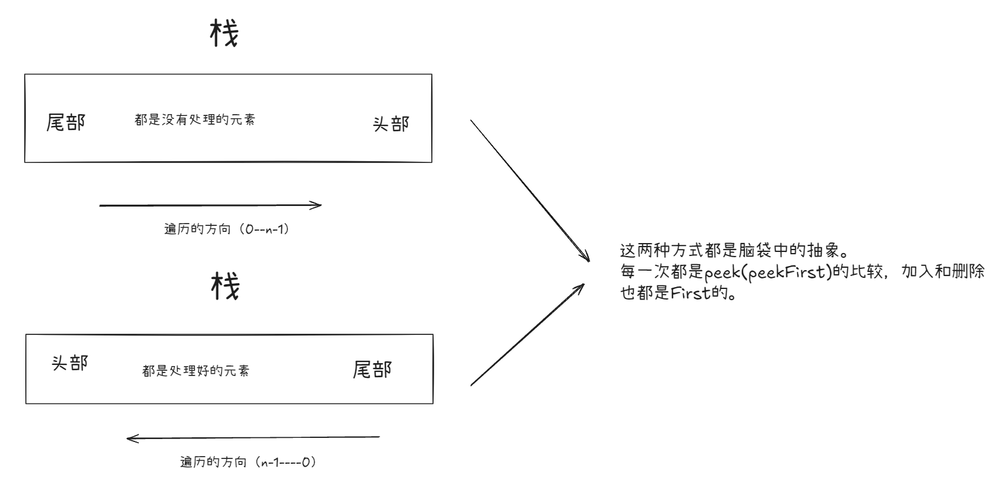
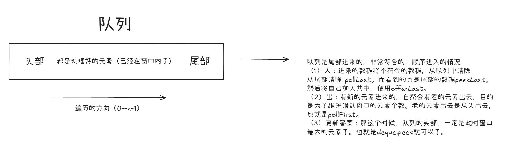

# 单调栈和单调队列解决的问题

## ✅ 开门见山：单调栈 vs 单调队列的作用对比表

| 结构     | 本质用途                    | 适用场景                         | 解决了什么问题                             |
| -------- | --------------------------- | -------------------------------- | ------------------------------------------ |
| 单调栈   | 快速找左右第一个更大/更小值 | 柱状图最大面积、每日温度、接雨水 | O(n) 找到「谁是我左右边第一个更大/小的值」 |
| 单调队列 | 维护滑动窗口区间最大/最小值 | 滑动窗口最大值、最短子数组长度   | O(n) 动态区间内维护极值                    |


# 脑袋中的形象图

## 栈




## 队列



>#### 队列是尾部进来的，非常符合的，顺序进入的情况
>
>#### （1）入：进来的数据将不符合的数据，从队列中清除
>
>#### 从尾部清除 pollLast。而看到的也是尾部的数据peekLast。
>
>#### 然后将自己加入其中，使用offerLast。
>
>#### （2）出：有新的元素进来的，自然会有老的元素出去，目的
>
>#### 是为了维护滑动窗口的元素个数。老的元素出去是从头出去，
>
>#### 也就是pollFirst。
>
>#### （3）更新答案：那这个时候，队列的头部，一定是此时窗口
>
>#### 最大的元素了。也就是deque.peek就可以了。


# 前缀和的书写

```java
int[] pre = new int[n + 1];

for(int i = 0; i < n; i++)
{
    pre[i + 1] = pre[i] + nums[i]; // 前缀和的标准写法。
}

pre[i] 表示的是 从0 到 i-1的值的，是左闭右开的写法，可以避免很多特别的判断
```


