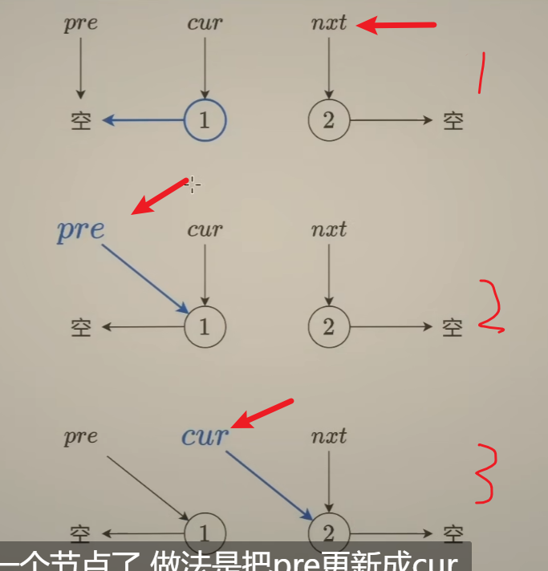
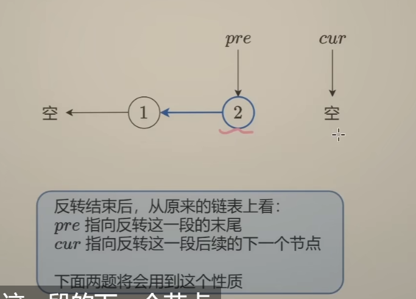
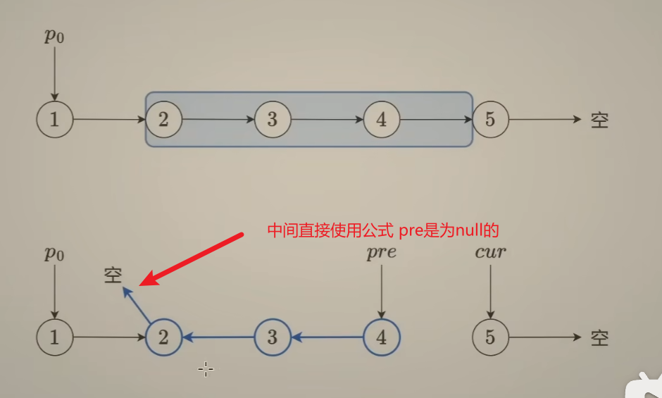
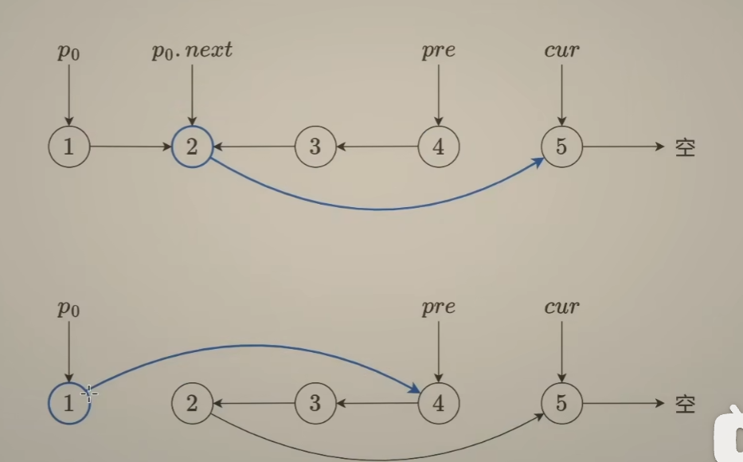
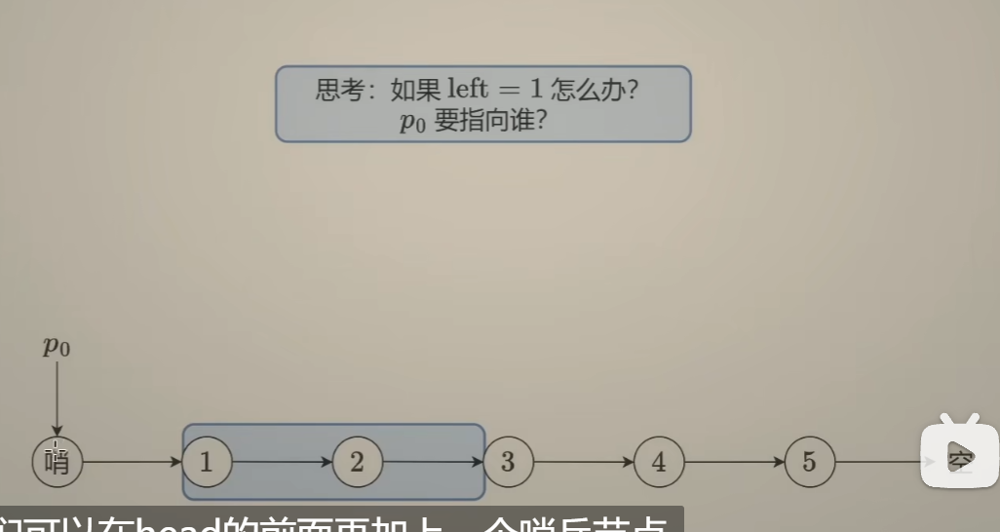

# 反转链表

## 反转链表的循环过程

* #### 第一步：拿到下一个next，保留current原来的next。并且，current.next = pre; 注意：此时的pre一定为null，这个是我们刻意为之，是为了写代码方便，后续链表内的某一段的反转也是如此。

* 第二步：pre移动

* 第三步：cur 移动

>#### 在结束之后，pre指向这一段的末尾的，cur指向的是这一段末尾的下一个（可能有，可能null，不用管，直接取值。）

## 某一段内的反转链表

 这里需要注意的是：

* （1）中间的链表 依旧是根据之前的公式来的。pre依旧是null，也就是空。并不是所谓的第一个操作链表节点

​      前一个。这样的话，每次执行完反转之后，都会是第一个节点的next指向的是null，最后一个节点，是pre，

​      而current指向的是pre的next，可能是一个节点，也可能是null，不过这个我们不需要管，直接使用里面的元素

​      就好了。

* （2）第二步才是捋顺一下顺序。前面的po节点需要连接上pre,后第一个节点的next连接上 current

  

* (3) 第一个节点的next怎么表示，pre和current都移动到后面了，这个时候只有po有，所以是 

​        po.next.next = current; // po后面节点的next元素 po.next = pre;

* (4)还有一个特殊的情况没有解决。当left即反转的链表的第一个元素是整个链表的第一个元素的时候。这个时候 的po是什么？？为null，换句话说，null是没有办法存储left的位置信息的，那到时候，我们需要po.next.next来定位最后一个反转后的最后一个元素的，即一开始没有反转的left，那怎么办？？人造一个节点，来保留所谓的 left的位置信息。

* #### 这里的pre在创建的时候 一定是空的。

### 这里的po不存在的话，需要建立一个哨兵节点

* #### 加上哨兵节点的目的，是为了去保存 反转链表那一段初始的left，因为这段left节点的next在反转结束的时候，需要指向current，而pre和cur都移动到后面去了，所以需要额外的变量保存。

* #### 还有就是，在left是整段链表最左边的这个节点的时候，这个时候，没有原生节点，这个时候我们需要创建一个哨兵节点。指向最左边的left保存信息。所谓的创建节点，是真的需要创建一个node，在left的前面，而不是创建一个引用，指向left，虽然这样也能保存left的信息，不过这样创建节点的话，使得，我们写代码的时候，一份代码能适用，有po和没有po的时候，更加方便。——需要创建po节点

  * #### 策略是：我们不管left前面有没有对应的原生节点可以当做是po，我们都初始化一个dummy节点，也就是所谓的哨兵节点。初始化这个节点的next指向的是head。

  * #### 接下来，我们需要去找到left前面的一个节点，也就是left - 1，怎么过去，需要你遍历过去。遍历多少次？你现在的next在head上，你的目标是left - 1，遍历的次数是，左开右闭，即减法即可。（left - 1 - 0），也就是遍历 left - 1就可以。（这里是从0开始的）。使用for循环就可以控制。left - 1次的话，int i = 0; i < left - 1; i++

  * #### 这样的话，dummy的next指向的就是left - 1了

* #### 那么链表在存在po的时候，怎么知道po的节点的位置呢？？链表不能拿前面的数据啊？？

  * #### 上面写了，循环移动找到前面的节点。

