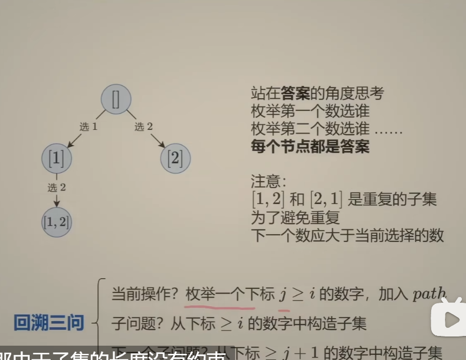
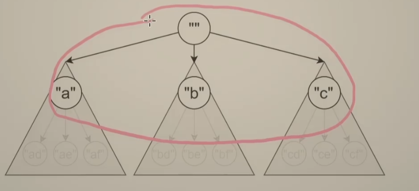
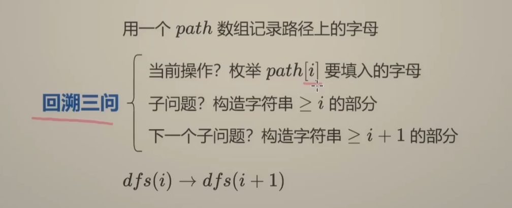

# 回溯的需要恢复现场的原因

### 在这个回溯过程中：

1. ### 每走一步，对于 nums[i]，有两个选项：要么不选它，要么选它。每个选项就像是在树上走一个分支。

2. ### 但是我们一次只能处理一个分支，计算完了【不选】的分支，就要倒回去，回到前面去处理另外一个【选】的分支。

3. ### 倒回去的过程中，之前加到 path 中的数据是垃圾数据，要及时清除掉（恢复现场）。——后序的感觉，你递归完了之后，返回到本节点之后， 你需要将之前所有的信息都给清除掉。


# 分割字符串模板 得背下来

* #### （1）分割字符串 这个傻叉 ，最后至少得分割一次。也就是最后一次，得到其自己。

* 

```java
class Solution {
    public List<List<String>> partition(String s) {


        List<List<String>> list = new ArrayList<>();

        List<String> path = new ArrayList<>();


        dfs(list,path,s,0,0); // 起点都是00
        return list;
        
    }

    public void dfs(List<List<String>> list, List<String> path,String s,int index,int pre)
    {   
        // pre表示上一次选择的起点

        //每个字符中间 看做是一个逗号，选择还是不选择
        // 逗号表示的是分割，可以看做是三个逗号，abb,  a,ab,  aa,b 三种情况
    
        // 题目一定保证至少有一个回文串的，所以不存在 所有都不选逗号的情况，至少选一次，不存在没有的情况
        // index还是表示元素，只是用来表示 index 和index + 1之间的逗号，这样更好理解
        // index依然是表示 选择的次数
        if(index == s.length())
        {
            // 全部选择完了
            list.add(new ArrayList<>(path));
            return;
        }

        if(index < s.length() - 1) // 只能到倒数第二次，最后一次必须选择
        {
            dfs(list,path,s,index + 1,pre);
        }

        // 那就开始选择
        if(isCircle(s.substring(pre,index + 1)))
        {
            // 如果是真的回文串
            path.add(s.substring(pre,index + 1));
            dfs(list,path,s,index + 1,index + 1); // pre应该是 这个开区间的边界
            // 恢复一下
            path.removeLast();
        }

    }

    public boolean isCircle(String s)
    {
        char[] c = s.toCharArray();

        int left = 0;
        int right = c.length - 1;


        while(left <= right)
        {
            if(c[left] != c[right]) return false;
            left++;
            right--;

        }

        return true; // 如果循环完了 还是相等的话 那么就是了

    }


}
```


# 子集回溯——站在答案的角度的角度去思考



* ### 🧠 “答案视角”理解：

  > 我要构造长度为 3 的排列，答案有 3 个格子：`[_, _, _]`
  >
  > - 第 1 位我可以填谁？1、2、3（任选一个）
  > - 第 2 位我可以填谁？剩下两个没填过的数
  > - 第 3 位我可以填谁？剩下一个没用过的数
  > - 填满了就收一个答案

* 也就是我这个答案的，第一个填什么，第二个填什么。

* 站在子集的角度上

  * （1）【1,2】和【2,1】是他妈重复的。那么为了避免这种情况，我们得规定一个顺序，当我们枚举了一个数之后，后面的数的下标只能比这个数大。这样的话，就不会回头了。
  * 而且站在子集的角度去考虑的话，每一个节点都是答案。
  * 那么如果枚举不到了呢？？当然了，你枚举的范围，肯定和你的元素的范围n有关的。


# 子集类型问题的总结

## 📌 所以，这种写法与“选 or 不选”的区别在于：

- “选 or 不选”是「一棵二叉树」：每个数都可以选 or 不选，左右分支
- “答案构造”是「多叉树」：每次都选一个没选过的数来作为 path 的下一位，构建全路径


好，咱现在就针对：

> 示例：`nums = [1,2,3]`
>  输出应为：`[[], [1], [1,2], [1,2,3], [1,3], [2], [2,3], [3]]`

来 **分别构建这两种写法下的回溯树结构**（一棵是二叉树，一棵是多叉树），你就能彻底理解：

------

# ✅ 第一种：**“选 or 不选”视角 → 二叉树结构**

> 每个数有两个选择：选 / 不选 → 构建出一棵 2^n 大小的二叉树

```java
                                 []
                         /                   \
                     [1]                     []
                 /       \               /       \
            [1,2]       [1]           [2]         []
            /   \       /  \         /   \       /   \
      [1,2,3] [1,2] [1,3] [1]   [2,3]  [2]   [3]   []
```

### 🧠 每一层代表“是否选第 i 个数”：

- 第 0 层：是否选 nums[0] → 1 or skip
- 第 1 层：是否选 nums[1] → 2 or skip
- 第 2 层：是否选 nums[2] → 3 or skip

------

### ✅ 对应代码（传统“选/不选”）

```java
void dfs(int i, int[] nums, List<Integer> path) {
    if (i == nums.length) {
        res.add(new ArrayList<>(path));
        return;
    }

    // 选择 nums[i]
    path.add(nums[i]);
    dfs(i + 1, nums, path);
    path.remove(path.size() - 1);

    // 不选择 nums[i]
    dfs(i + 1, nums, path);
}
```


# ✅ 第二种：**“答案结构视角” → 多叉树结构**

> 每一层递归都代表「我当前准备往答案中加一个新的元素」，可以从当前 index 开始枚举往后所有值

## 树结构如下（🌲每层不是选/不选，而是选谁作为下一个）：

```java
                       []
              /         |         \
           [1]         [2]        [3]
          /   \         |
     [1,2]   [1,3]     [2,3]
       |
    [1,2,3]
```

每次 `dfs(i)` 就是问：

> “我还能从 `nums[i] ~ nums[n-1]` 里选谁，接在 path 后面？”

------

### ✅ 对应代码（你发的“答案结构”版本）

```java
void dfs(int i, int[] nums, List<Integer> path) {
    res.add(new ArrayList<>(path)); // 每次都把当前 path 加进去
	// 为什么这里不用判断 边界条件呢？？因为如果你的index变化的很大的话，那你就进不去循环了，不能再递归下去了，那自然就结束了
    for (int j = i; j < nums.length; j++) {
        path.add(nums[j]);
        dfs(j + 1, nums, path); // 下一次只能从 j+1 开始选，避免重复
        path.remove(path.size() - 1);
    }
}
```

------

* #### // 为什么这里不用判断 边界条件呢？？因为如果你的index变化的很大的话，那你就进不去循环了，不能再递归下去了，那自然就结束了

# 📌 最终结果回顾

不管你用哪种方式构建，最后得到的 `res` 都是：

```
[
 [], 
 [1], [1,2], [1,2,3], [1,3], 
 [2], [2,3], 
 [3]
]
```

但你思考的方式完全不同！

# ✅ 总结对比

| 维度         | 选/不选（二叉树）                  | 构造答案结构（多叉树）               |
| ------------ | ---------------------------------- | ------------------------------------ |
| 每层意义     | 是否选当前元素                     | 当前这一层枚举谁作为下一个           |
| 树结构       | 每个节点出两条边（选 / 不选）      | 每个节点出多条边（枚举可能）         |
| 递归参数     | 当前下标 i                         | 当前下标 i（表示下一个元素起始位置） |
| 核心递归动作 | dfs(i+1)（不选） 和 dfs(i+1)（选） | dfs(j+1)，j ∈ [i, n-1]               |


# 组合问题和子集问题的关系

* #### 其实子集问题是带有限制的组合问题。

* #### 组合问题和子集问题，都是可以从多叉树的角度去思考的。这个是最通用的、

  * #### 从答案的角度去思考的，第一个答案到底有多少中可能性，然后就可以不管了。接下来第二个答案的可能性交给递归去做，我们只需要写好边界条件就好了。

* 

* 


# index在多叉树 和二叉树中的不一样

* #### 题解中写了 i 的意思。这里我整理一下：选或不选中的 i，表示当前考虑 candidates[i] 这一个数，可能选它，也可能不选它。枚举选哪个中的 i，表示当前要在 [i,n-1] 这一堆数中选一个数。

## 🔑 核心对比总结：

| 回溯模型               | `index` 的含义                          | 本质结构         | 典型题目             |
| ---------------------- | --------------------------------------- | ---------------- | -------------------- |
| ✅ 多叉树（选谁）       | **表示从哪个元素开始尝试选**            | 横向展开（广度） | 组合、全排列、n 皇后 |
| ✅ 二叉树（选 or 不选） | **表示当前决策的是第几层 / 第几个元素** | 纵向深入（深度） | 子集、0/1 背包       |

## 🧠 图解对比：`index` 在两种回溯中的含义

### ✅ 多叉树结构（“选谁” —— 从 index 开始枚举候选）

```
         []
     /    |    \
    1     2     3     ← index=1，开始选
   / \   / \   / \
  2  3  3  4  4  5     ← index=i+1（只往后选）
```

- 每一层是“我要选出 path 中的第 k 个数”
- `index` 表示当前要从哪个数字往后开始选，防止重复
- 构成的是一个 **多叉树**，每一层有多个分支（候选值）

------

### ✅ 二叉树结构（“选 or 不选” —— 每层看当前 index 要不要选）

```
                    []
                /       \
              不选1      选1
             /    \     /     \
         不选2   选2  不选2   选2
          ...     ...     ...
```

- 每一层只考虑一个元素（index 指向当前这个元素）
- 然后做两种选择：要不要它
- `index++` 表示深入下一层，决策下一个元素
- 构成的是一颗**二叉树**，每一层两个分支（选 or 不选）

------

## 🧠 实战记忆法：

你可以永远记住这一对口诀：

> ✅ 多叉树：**选谁放进 path —— for (i = index; ...)**
>  ✅ 二叉树：**当前 index 选 or 不选 —— 两个递归**

------

## ✅ 一个细节提醒：

你一旦看到 `for (int i = index; i <= n; i++)` 这种结构，并且里面在递归 `dfs(i + 1)`，十有八九是组合/排列类的问题（选谁）。

一旦看到 **两个递归分支 + `index + 1`**，一定是选不选问题（子集、背包、剪枝型搜索）。


# 回溯规律总结

* #### 一般来说，类似【选或不选】的写法是递归 i+1，类似【枚举选哪个】的写法是递归 j（即每一次按照index，的位置开始 int i = index，继承上一次的index）。

  * #### 在枚举当中，需要看你的 枚举是否可以重复。

    * #### 不可以重复，那么你每次 都是依靠index过去的。下一次都是按照index开始的

    * #### 如果是可以重复的话，那你每次都是0开始的。不能是index。因为重复的话，也不是子集问题，就像下面的全排列问题一样

  * #### 而所谓的选和不选就是子集问题，其i表示的是按部就班的深度，当其等于最大的深度的时候，那么就结束了。


* #### 而对于全排列问题：不存在选和不选的问题，因为选和不选，是子序列的问题。全排列的话，是不存在的。全部都要选。可以传入一个leave数组 来维护 哪些变量选了，哪些变量没选。后续遍历就在这个leave中遍历就好了。

  * ```java
    class Solution:
        def permute(self, nums: List[int]) -> List[List[int]]:
            # 1. 每个位置都要填一个数
            # 2. 每个位置填的数互不相同
            n = len(nums)
            ans = []
            path = [0] * n
            def dfs(i: int, s: Set[int]) -> None:
                if i == n:
                    ans.append(path.copy())
                    return
                for x in s:
                    path[i] = x
                    dfs(i + 1, s - {x})
            dfs(0, set(nums))
            return ans
    ```


# 剪枝的规律

## ✅ 一图理解剪枝的两种类型

```
                [root]
               /   |   \
        🚧→X /    |    \ 🚧→Y
            /     |     \
        [a]     [b]     [c]
         ↓       ↓       ↓
```

我们要进入 a/b/c 三条路径。

### 🔸「选择级剪枝」：

> 在 for 循环阶段，提前检测某个选择不合法，**就不进入对应的子树**。

像你说的：

> 🧭 它是“保驾护航”，**防止你进入错误的门**。

```java
for (int col = 0; col < n; col++) {
    if (该列被占用 || 该斜线被占用) continue; // 👈 保驾护航式剪枝

    做出选择
    dfs(下一层)
    撤销选择
}
```

------

### 🔸「状态级剪枝」（dfs 顶部）：

> 如果你已经做了一些合法选择，但是**组合起来导致整体状态非法**，那么在你刚进入下一层 `dfs` 的开头，**直接掐掉不让深入**。

像你说的：

> 🧨 “你已经开门进来了，我一看你这状态不对，直接请你出门。”

```java
void dfs(...) {
    if (前面几步选择组合后，整体状态非法) return; // 👈 立即掐掉

    for (int i = 0; i < n; i++) {
        ...
    }
}
```

## 🧠 为什么要同时存在这两种剪枝？

因为它们**处理的不是同一类错误**：

| 剪枝位置   | 处理的错误种类                   | 本质             |
| ---------- | -------------------------------- | ---------------- |
| for 循环中 | 当前“选择”单个值不合法           | **局部剪枝**     |
| dfs 顶部   | 之前所有选择组合起来导致非法状态 | **全局状态剪枝** |


