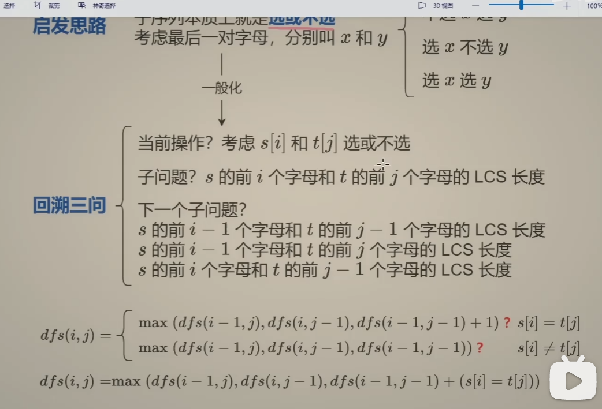
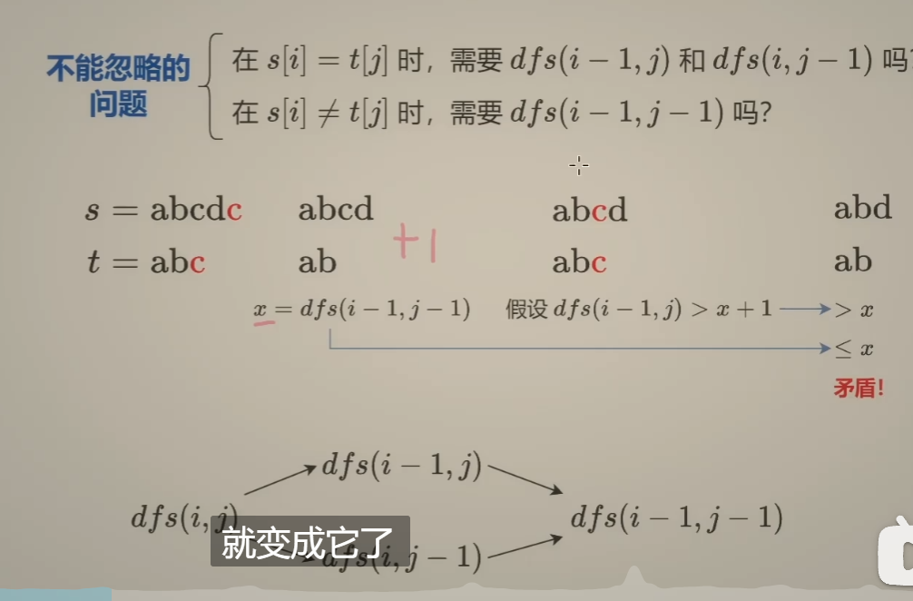
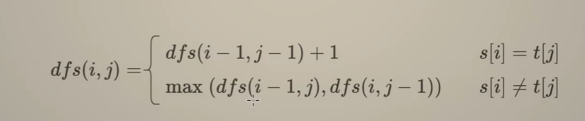

# 最长公共子序列（两个序列的最长）

* #### 这个问题的本质在于：再次引入了一个变量，那就是另外一个变量限制。

## 最长子序列的通用考虑方式

* #### 就是考虑四种情况

  * #### x选和y不选

  * #### x不选和y选

  * #### x和y都不选

  * #### x和y都参与选择

* #### 由于这里是最长，那么`max`的话，四种情况是都需要考虑进去的。

## 最长子序列的优化

* #### 这里求的结果是最长的，那么我们能不能提前知道 这四种情况之间的关系，找出类似于`A >= B`的关系之后，我们就可以，max只看`A`了。不过这种优化仅仅限制于这种的，

* #### 如果要求你求的只是方案的总数，那么你就需要将全部的都考虑进去了。

### s[i] = t[j]的时候，只考虑哪一种呢？？

* #### 经过论证的话，我们会发现，`s[i] = t[j]`，也就是双方都相等，都可以选择的前提条件。当这个前提条件满足的时候，会发现，要比其他的两个，单独选的 一定是`xy >= x no y 以及 xy >= nox y的`。

* #### 只需要选择`dfs(i-1,j-1) + 1`就可以了。

### s[i] != t[j]的时候，应该怎么考虑呢？

* #### 不相等话，那肯定就没有都选择的这一条分支了。

* #### 然后经过检验发现，`dfs(i-1,j)以及这个dfs(i,j-1)里面是包含了这个dfs(i-1,j-1)`都不选在里面的，所以只需要考虑单独选一个人的情况就可以。

* #### 注意，这个本质是一种优化，只是在最长的情况是有效的。

